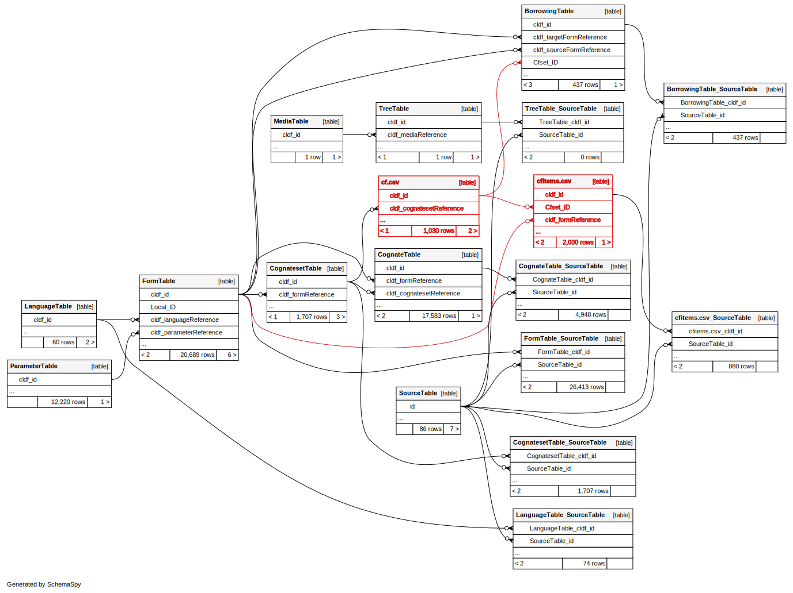
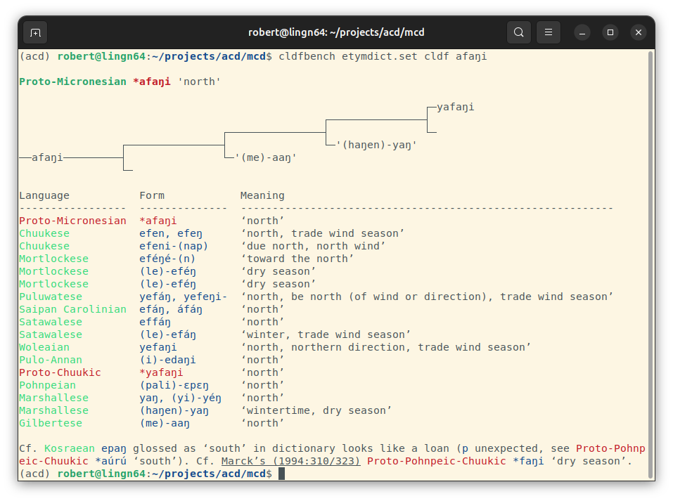

# pyetymdict

The package provides a CLDF data model for etymological dictionaires layered on top of CLDF Wordlists 
curated via `pylexibank` and a [cldfbench](https://github.com/cldf/cldfbench) subcommand to display
complex cognate sets from such datasets.

## Data model

Etymological (or comparative) dictionaries - as understood here - are essentially collections of
cognate sets. In CLDF this translates to *Wordlist* datasets with a *CognateTable* component.
Typically, such dictionaries use cognate sets to reconstruct proto-forms. In CLDF, these proto-forms
are modeled as rows in *FormTable*, linked to a proto-language in *LanguageTable*, and linked from
a row in *CognatesetTable*. Often, comparative dictionaries also list groups of loanwords and other groups of seemingly cognate
forms. This is modeled via the custom tables `cf.csv` and `cfitems.csv` added in `pyetymdict.Dataset.schema`.

The complete data model (in CLDF SQL) of an etymological dictionary looks as follows:

## CLI

`pyetymdict` provides a `cldfbench` subcommand to display cognate sets on the UNIX shell.

